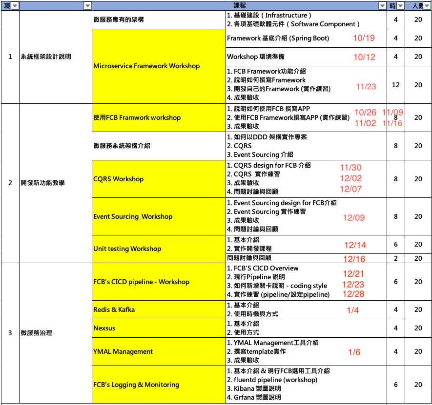
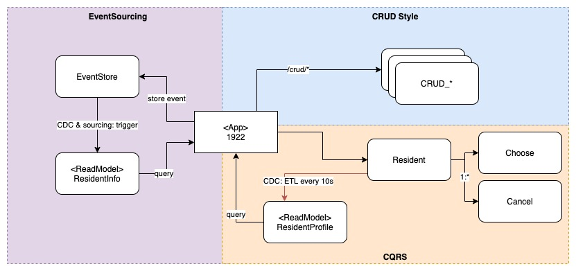

# FirstBank Knowledge Transfer Workshop
第一銀行微服務中臺 - 技術移轉工作坊

- 2021-10-19 - Java 基礎 & Framework 基底介紹 (Spring Boot)
- 2021-10-26 - Mimosa Framework: dependencies, lombok, mapstruct, openapi-ext
- 2021-11-02 - Mimosa Framework: data-jpa-ext
- 2021-11-09 - Mimosa Framework: web, exception handle

## 課程

- 白底 - 演講性質課程
- 黃底 - 工作坊性質課程, **參加的學員需自備電腦及網路**

> 上表順序非上課順序, 講師會依實際授課情況適度調整

## Workshop 1922 System

